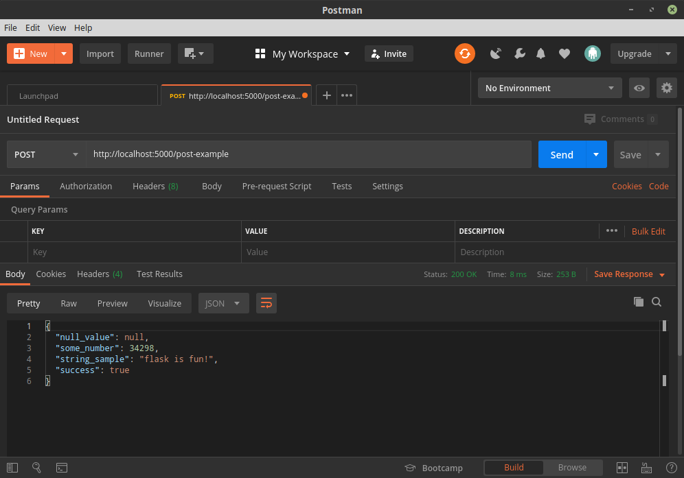
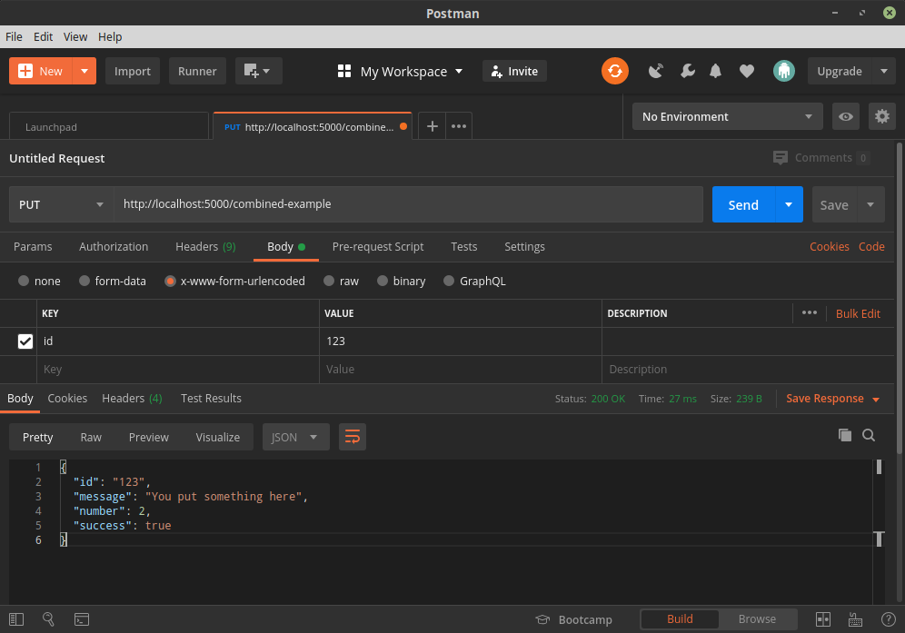

# Flask Workshop

This workshop is a basic introduction to Flask, a popular webframework for
Python. Flask allows you to build Web applications in a simple way. An alternate
is Django, which follows a batteries-included approach. Flask follows the
opposite approach.

Flask can be used to build many things, from complex web applications to IoT
projects such as the trainer's [Speaking Bookshelf](https://youtu.be/aEYftBZz6ag).

## About the Instructor

Vinay Keerthi is a self-taught programmer who has been meddling with, and
breaking computers since he was 14. His first computer was an Atari 600XL,
which he used to program in BASIC. His programming interests include Python,
MicroPython and Rust. He is currently writing a book on MicroPython which
will be published by Apress around December 2020.

## Agenda

1. Basics
    1. Decorators and Getting Started
    2. Add HTML to the content of the home page.
    3. Move HTML to a template page.
    4. Add a second page.
    5. Modularize both pages.
2. Routes
    1. GET and queries
    2. Using Postman
    3. POST
    4. PUT, DELETE
3. Debugging with VS Code.
    1. Adding a `launch.json` file
4. Adding a Database
    1. flask_sqlalchemy: db.Model example table
    2. Adding a second table.
5. Flask shell
    1. Using flask-shell to debug.
    2. Adding values to the database.
    3. Querying values
    4. Removing values from the database.
6. Front-End
    1. Adding Bootstrap CSS.
    2. Adding a simple template.
    3. A simple form.
7. Flask Modularization
    1. moving files.
    2. blueprints
    3. logging to a file
8. Creating an Application
    1. Designing the API with Stoplight Studio
    2. Adding helper command to `flask` CLI to load data.
    3. Add a flask extension: `flask-admin`
    4. Home page
    5. Movie display page.
    6. [BONUS] Dockerfile!


## Installation

Make sure you install Python 3.6 or greater. Use Anaconda or Miniconda if you
don't know how.

Then follow these steps.

```bash
# Windows users, make sure you have git installed.
git clone https://github.com/bangpypers/23-05-2020-flask-workshop.git
cd 23-05-2020-flask-workshop
python -m venv env
source env/bin/activate
# env\Scripts\activate.bat for Windows. You shouldn't prefix this with `source`

pip install -r requirements.txt
```

This is enough to get you setup for the workshop.


## Using the Tags

This repository will always have a `master` branch that is latest with the
final state of the application. However, that will be daunting for anyone to
read through. So, please make continuous use of the tags that I have put together
to rewind to older states of the application.

### Listing all Tags

To list all tags: `git tag -l -n9`


### Rewinding the App

To rewind the app to a specific tag, use the following command:

```bash
git checkout v0.1
```

You can feel free to make changes or play around with the application.

### Fast-forwarding the App

Just checkout a later commit:

```bash
git checkout v0.9
```

The decimal portion of the application version will correspond to the agenda.


## Running the App

From v0.7.x, the app should be run using the `wsgi.py` file. WSGI stands for
Web Server Gateway Interface. Flask apps should not be run in production
using `flask run`. And they should not rest in one file. A modular approach
ensures that all the modules are easy to debug, and the history is isolated to
separate files.

```bash

export FLASK_APP=wsgi.py
export FLASK_DEBUG=1
# windows users,
# use SET instead of EXPORT
flask run
```

Open [this page](http://localhost:5000) on your browser.

To check out the search URL, try this [page](http://localhost:5000/search?query=pink+socks).

### Trying httpie to test the API

You can use the `http` command to test the API.

```bash
http http://localhost:5000/json-example
```
Note: Ensure you have installed httpie using:

```bash
pip install -r requirements.txt
```

The output I get is:
```
HTTP/1.0 200 OK
Content-Length: 96
Content-Type: application/json
Date: Fri, 22 May 2020 17:26:39 GMT
Server: Werkzeug/1.0.1 Python/3.8.3

{
    "animal": "Cat",
    "name": "John Doe",
    "place": "Amsterdam",
    "thing": "Volleyball"
}
```

## Using Postman to Test the API

Sometimes it is easier to use a GUI to
check your API. Postman is one such app for this.


## Reading the source code:

The easiest way to read the final application is from the `app.py` file. The
function `create_app` is your entrypoint into the application.


## About Routes

This section explains a bit about routes and queries.

### Routes

When you visit a URL you are probably used to seeing the `https://www.google.com/` portion of the website. Everything following the first `/` after the `.com` (this could be `.org` or `.in` or anything else) is the *route* for the page.

For your site, when you visit `http://localhost/`, the default *route* is the
*index*. This is `/`. We added a `/about` route, mapping a page to it.

If you noticed in the first example, we *don't* need to return **html**
content for a request. We can return anything, really.

### Types of Routes

#### GET

The default type of request is *GET*. This can be interpreted literally.
*Get* what I asked for.

`http://localhost:5000/` means *get the index route of http://localhost*.

`http://localhost:5000/about` means *get the about route of http://localhost*.


#### POST

A POST is a different type of request. When a client (this is a browser or
a script such as what I will show you now) sends a POST, it is usually from
an internal function and never from the URL in a browser. The address bar
always performs a *GET*.

To try out our sample API for POST:

```bash
http POST :5000/post-example
# httpie allows you to just skip the http://localhost part of the URL nicely.
```

Output:

```
HTTP/1.0 200 OK
Content-Length: 107
Content-Type: application/json
Date: Fri, 22 May 2020 17:51:29 GMT
Server: Werkzeug/1.0.1 Python/3.8.3

{
    "null_value": null,
    "some_number": 34298,
    "string_sample": "flask is fun!",
    "success": true
}
```

In postman:




#### Multiple Method Routes

You can have combined routes by using the `methods` argument to `@app.route`.
This enables you to use `request.method` to change the behaviour of your
API based on how users are using it.

Test it out.

##### GET
```bash
http GET :5000/combined-example -f
```

Output:
```
HTTP/1.0 200 OK
Content-Length: 82
Content-Type: application/json
Date: Fri, 22 May 2020 18:13:15 GMT
Server: Werkzeug/1.0.1 Python/3.8.3

{
    "message": "You got what you asked for.",
    "number": 1,
    "sucess": true
}
```

##### POST

```bash
http POST :5000/combined-example id=10 -f
```

Output:

```
HTTP/1.0 200 OK
Content-Length: 91
Content-Type: application/json
Date: Fri, 22 May 2020 18:13:39 GMT
Server: Werkzeug/1.0.1 Python/3.8.3

{
    "id": "10",
    "message": "You posted something",
    "number": 2,
    "success": true
}
```

##### PUT
```bash
http PUT :5000/combined-example id=123 -f
```

Output:
```
HTTP/1.0 200 OK
Content-Length: 93
Content-Type: application/json
Date: Fri, 22 May 2020 18:14:27 GMT
Server: Werkzeug/1.0.1 Python/3.8.3

{
    "id": "123",
    "message": "You put something here",
    "number": 2,
    "success": true
}
```
In Postman:



##### DELETE

```bash
http DELETE :5000/combined-example id=92 -f
```

Output:
```
HTTP/1.0 200 OK
Content-Length: 92
Content-Type: application/json
Date: Fri, 22 May 2020 18:15:25 GMT
Server: Werkzeug/1.0.1 Python/3.8.3

{
    "id": "92",
    "message": "You deleted something",
    "number": 2,
    "success": true
}
```

### Data in routes

Routes sometimes have meaningful data in them. A good analogy is to think
of a route as a postal address.

In API terms:

```
charlie
road #42
ChocolateFactory
```

could become:

```/ChocolateFactory/road/42/charlie```

Note that this does not follow any sort of standard on how APIs *should*
look, but this is quite feasible.


## About Queries

A query is the *second* easiest way to pass data to a route. You have used
queries millions of times without realizing it. Google uses a query to
lead you to the search results: `https://www.google.com/search?q=how+do+I+use+google`.
the `?q=...` portion is just a query where the API gets the values after `?`
as an accessible string.


## Running the VS Code Debugger

The [Official docs for VS Code](https://code.visualstudio.com/docs/python/tutorial-flask#_run-the-app-in-the-debugger) cover how to use the debugger nicely.

## Adding a Database

An application most often needs a database. Adding one with `flask_sqlalchemy`
is simple.

Once you make the changes that are in v0.4.2, make sure to run the following:

```bash
export FLASK_APP=app.py
export FLASK_DEBUG=1
flask shell
>>> from app import db
>>> db.create_all()
# This creates the database.
```

### Adding Values

In the flask shell:
```python
from app import Movie, db
movie = Movie(title="The Mask")
db.session.add(movie)
db.session.commit()
```

### Querying Values

```python
from app import Movie
movie = Movie.query.filter(Movie.title.like("%Mask%")).first()
print(movie)
```

### Deleting Values

```python
from app import Movie, db
movie = Movie.query.filter(Movie.title.like("%Mask%")).first()
print(movie)
db.session.delete(movie)
db.session.commit()
```

### About SQL

If you are new to SQL, I strongly recommend reading the first few sections
of the `postgresql` documentation, linked in the resources section below.


## Modularization

A flask app becomes more complex as it grows. This is when you should break
it up so that your logic becomes easier to debug.

The `v0.7.x` tags show how to split the previous application into several
modules.

### Blueprints

In Flask, blueprints are a modular way of seggregating the API. A blueprint
behaves like a regular flask app, but it does not run until it is attached
to a flask application. The reason we use a blueprint is so that if the app
has to be used in another application, then it can be easily imported there
and used.

Check `workshop/blueprints` for more info.


## API Design with Stoplight Studio

Stoplight studio is a great way to chart out an API before you begin
work on it.

You can design the API and then export a swagger file that tells other
developers how you wanted to design the API at a later point.

Here are some screenshots.


Take a look at the `swagger.yml` file to know more.


## Flask Commands

You can add and create your own flask commands. Check out app.py and the
section using `app.cli` for more. See tag v0.8.2.


## Building and Running the Dockerfile

As a bonus I have included a dockerfile for this application.

To build:

```bash
docker build -t workshop .
```

To run:

```bash
docker run --rm --name workshop -p 5000:5000 workshop
```

## Free Resources

1. [Flask Website](https://flask.palletsprojects.com/en/1.1.x/)
2. [Flask Mega-tutorial](https://blog.miguelgrinberg.com/post/the-flask-mega-tutorial-part-i-hello-world)
3. [Explore Flask](http://exploreflask.com/en/latest/)
4. Git Tutorial [videos](https://git-scm.com/videos) [Pro-Git Book](https://git-scm.com/book/en/v2)
5. [Automate the Boring Stuff with Python](https://automatetheboringstuff.com/)
6. [Flask-SQLAlchemy](https://flask-sqlalchemy.palletsprojects.com/en/2.x/quickstart/)
7. [SQL Tutorial on Postgres Documentation](https://www.postgresql.org/docs/10/tutorial.html)
8. [Postman](https://www.postman.com/)
9. [StopLight API Design Tool](https://stoplight.io/)
10. [httpie Commandline tool](https://httpie.org/)
11. [Real Python Decorators Tutorial](https://realpython.com/primer-on-python-decorators/)
12. [Real Python Virtualenv Primer](https://realpython.com/python-virtual-environments-a-primer/)

## Contacting the Author

Vinay goes by @stonecharioteer everywhere.
[Twitter](https://twitter.com/stonecharioteer) is an easy way to reach
him, or reddit, if you are brave enough.
